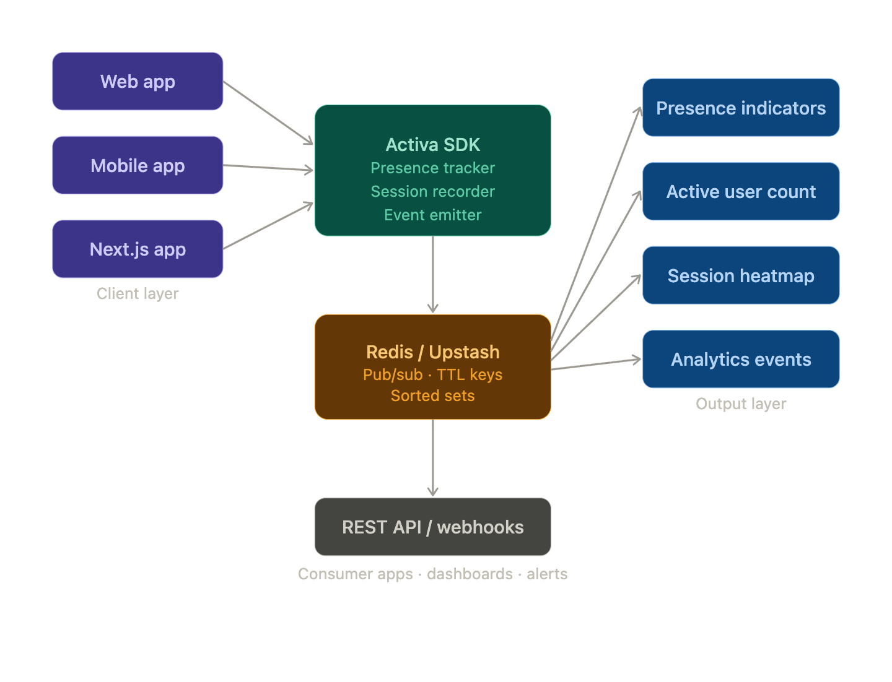

# Activaq

Activaq is a TypeScript SDK for Redis-powered real-time presence, active user counts, session heatmaps, and live room analytics.



This repo now ships as a small monorepo with:

- `packages/activa`: the publishable SDK package
- `examples/nextjs`: a real App Router demo showcasing presence, counts, heatmaps, recent events, and live SSE updates
- GitHub Actions + Changesets release prep for npm

## What’s included

### SDK

The `@activaq/sdk` package exports:

- `@activaq/sdk`: core Redis-backed presence + analytics engine
- `@activaq/sdk/browser`: browser tracker + HTTP client + SSE/WS stream subscription helper
- `@activaq/sdk/react`: React hooks for presence, counts, series, heatmaps, recent events, and live stream envelopes
- `@activaq/sdk/hono`: Hono route factory for REST + SSE streaming
- `@activaq/sdk/node`: a standalone Hono Node server with WebSocket streaming enabled
- `@activaq/sdk/testing`: in-memory storage adapter for tests and local demos

### Server features

- online/offline presence indicators
- active room counts
- session event recording
- click heatmaps aggregated into Redis buckets
- recent analytics event backlog
- SSE live room envelopes
- WebSocket live room envelopes in the standalone Hono Node server

## Workspace layout

```text
.
├── packages/
│   └── activa/
│       ├── src/
│       ├── test/
│       └── package.json
├── examples/
│   └── nextjs/
│       ├── app/
│       ├── components/
│       └── lib/
├── .changeset/
├── .github/workflows/
└── package.json
```

## Install

```bash
npm install
```

## Local commands

```bash
npm run test
npm run typecheck
npm run build
npm run check
npm run dev:example
npm run docker:build:demo
```

`npm run dev:example` starts the Next.js demo. Copy `examples/nextjs/.env.example` to `.env.local` inside the demo if you want to wire in Upstash/Redis or customize the demo room and endpoint. If `UPSTASH_REDIS_REST_URL` and `UPSTASH_REDIS_REST_TOKEN` are missing, the demo falls back to the in-memory adapter for local exploration.

## SDK quick start

### 1. Create the Activaq instance

```ts
import { createActivaq, createUpstashRedisStorage } from '@activaq/sdk';

export const activaq = createActivaq({
  namespace: 'my-product',
  redis: createUpstashRedisStorage({
    url: process.env.UPSTASH_REDIS_REST_URL!,
    token: process.env.UPSTASH_REDIS_REST_TOKEN!
  }),
  presenceTtlMs: 30_000,
  heatmapBucketMs: 300_000,
  heatmapCellSize: 24
});
```

### 2. Mount the Hono routes

```ts
import { Hono } from 'hono';
import { createActivaqHonoApp } from '@activaq/sdk/hono';
import { activaq } from './activaq';

const app = new Hono().basePath('/api');
app.route('/activaq', createActivaqHonoApp({ activaq }));
```

### 3. Track from the browser

```ts
import { createActivaqBrowserClient } from '@activaq/sdk/browser';

const tracker = createActivaqBrowserClient({
  endpoint: '/api/activaq',
  userId: () => window.__USER__.id,
  roomId: () => window.location.pathname,
  metadata: { plan: 'pro' }
});

await tracker.start();
await tracker.track({ type: 'cta_click', name: 'cta_click', x: 320, y: 180 });
```

### 4. Read it in React

```tsx
import { useActiveUsers, useHeatmap, usePresence } from '@activaq/sdk/react';

function PresenceDot({ userId, roomId }: { userId: string; roomId: string }) {
  const { online } = usePresence({ endpoint: '/api/activaq', roomId, userId });
  return <span data-online={online} />;
}

function ActiveUsersCard({ roomId }: { roomId: string }) {
  const { count } = useActiveUsers({ endpoint: '/api/activaq', roomId });
  return <strong>{count} online</strong>;
}

function HeatmapPanel({ roomId }: { roomId: string }) {
  const { cells } = useHeatmap({
    endpoint: '/api/activaq',
    query: {
      roomId,
      from: Date.now() - 30 * 60 * 1000,
      to: Date.now(),
      bucketMs: 5 * 60 * 1000,
      cellSize: 24
    }
  });

  return <pre>{JSON.stringify(cells.slice(0, 5), null, 2)}</pre>;
}
```

## Hono streaming

### SSE

`createActivaqHonoApp()` includes:

- `GET /stream/sse?roomId=...&cursor=$`

### WebSocket

The standalone Node helper enables:

- `GET /stream/ws?roomId=...&cursor=$`

```ts
import { createActivaqNodeServer } from '@activaq/sdk/node';

const server = createActivaqNodeServer({
  activaq,
  basePath: '/activaq',
  port: 3000
});
```

## Demo app

The real example lives in `examples/nextjs` and showcases:

- viewer identity bootstrapping
- auto presence heartbeats
- live active user counts
- roster snapshots
- rolling active-user series
- recent analytics events
- click-driven heatmap accumulation
- live SSE room envelopes

Open the demo in two browser tabs to see presence changes and live updates immediately.

Deployment presets and environment notes for the demo live in `examples/nextjs/README.md`.

## Tests

The package test suite covers:

- core presence + analytics behavior
- Hono REST routes
- SSE streaming
- standalone WebSocket streaming

## Publishing

Changesets + GitHub Actions are set up for npm publishing.

- Add a changeset: `npm run changeset`
- Version packages: `npm run version-packages`
- Publish the SDK locally: `npm run release`
- Publish from CI: push merged changesets to `main`

Set `NPM_TOKEN` in GitHub Actions secrets for the release workflow.
The release workflow publishes only the `@activaq/sdk` package, so the demo app can keep its local `file:` dependency during development.
